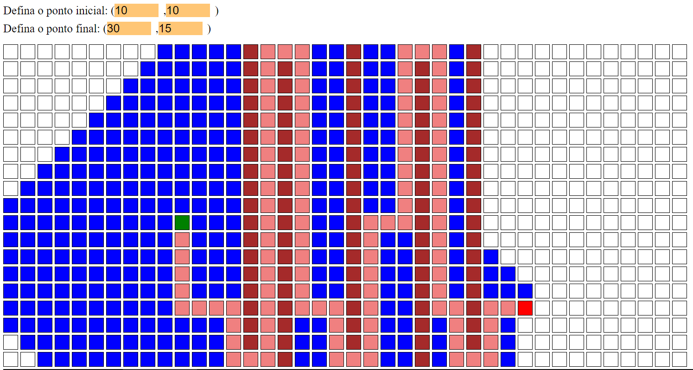
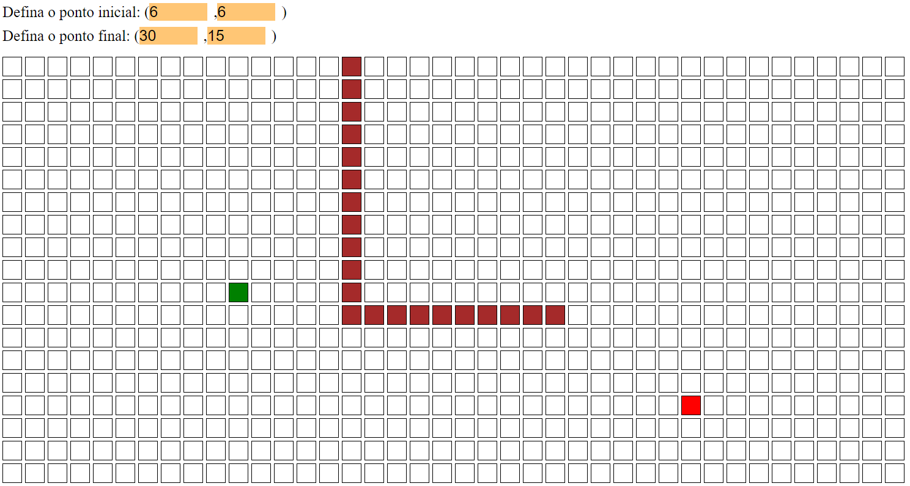

# Pathfinding visualizer
The following pathfinding algorithms were implemented to be visualized:
- Breadth First Search
- Depth First Search
- Greedy Search
- A*

The solution proposed in this project was to execute these algorithms using ReactJS, HTML, CSS and JavaScript. It was based on the Pathfinding Visualizer implemented by Clément Mihailescu, which can be viewed here: https://www.youtube.com/watch?v=msttfIHHkak.

My version is hosted on Heroku at this link: https://nagaoka-pathfinding-visualizer.herokuapp.com/

## Download and run in your computer
If you would like to make some modifications, follow these commands:

1) To download to your work environment:
```
git clone https://github.com/nagaoka-thiago/pathfinding.git
```
2) To install these project's dependencies:
```
npm install
```
3) To run these project:
```
npm start
```

## Using the visualizer
Here is an example of execution of A* algorithm:


Making walls is not hard, you need to click on the cell. The result is as the following image:

